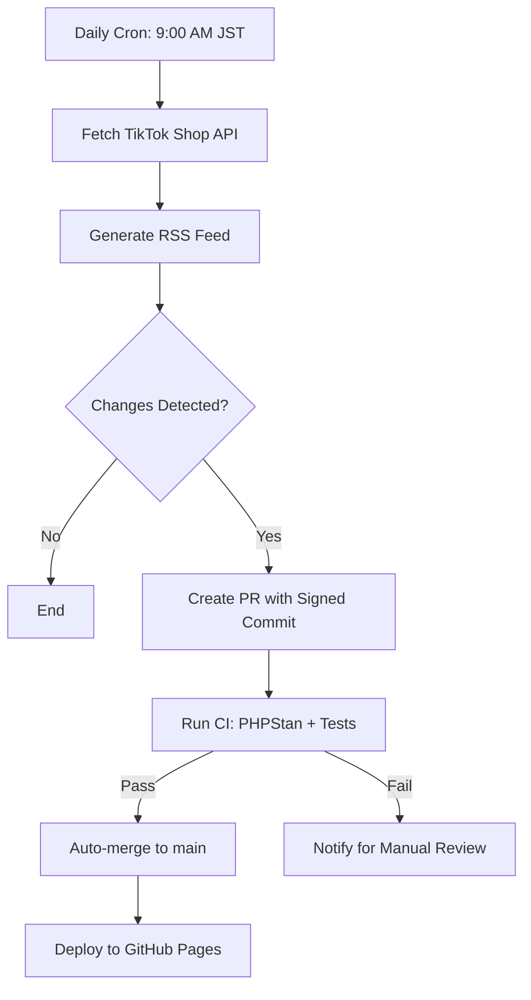

# 📡 TikTok Shop Developer Documentation RSS Feed

> **⚠️ Unofficial Project**: This is an **unofficial**, community-maintained RSS feed. It is **not affiliated with, endorsed by, or officially connected to TikTok or ByteDance**. For official documentation, please visit the [TikTok Shop Partner Portal](https://partner.tiktokshop.com/docv2/docs).

An automated RSS feed for TikTok Shop Developer Documentation updates, helping developers stay informed about API changes, new features, and important announcements.

## 🔗 Live Feed

**Feed URL**: [`https://meihei3.github.io/tiktok-shop-release-notes-rss/rss/index.xml`](https://meihei3.github.io/tiktok-shop-release-notes-rss/rss/index.xml)

**Website**: [https://meihei3.github.io/tiktok-shop-release-notes-rss/](https://meihei3.github.io/tiktok-shop-release-notes-rss/)

## ✨ Features

- **🔄 Fully Automated**: Runs daily at 9:00 AM JST (00:00 UTC) via GitHub Actions
- **🏷️ Rich Metadata**: Includes keywords like "Coming Soon", "Action Required", "Breaking Change"
- **📝 Full Content**: Complete article descriptions with direct links to official documentation
- **🔍 Smart Detection**: Only publishes when actual content changes are detected (using contentHash)
- **✅ Quality Assured**: All updates go through CI verification (PHPStan, tests, code style)
- **🤖 Auto-merge**: Changes are automatically merged after CI passes

## 🚀 Quick Start

### Subscribe to the Feed

1. Copy the feed URL: `https://meihei3.github.io/tiktok-shop-release-notes-rss/rss/index.xml`
2. Add it to your RSS reader (Feedly, Inoreader, NetNewsWire, etc.)
3. Stay updated automatically!

### Local Development

```bash
# Install dependencies
composer install

# Generate RSS feed
composer generate-rss

# Run tests
composer test

# Code quality checks
composer phpstan
composer phpcs
```

## 🛠️ Technical Architecture

### Technology Stack

- **PHP 8.4**: Modern PHP with readonly classes and match expressions
- **Symfony Console**: CLI command framework
- **Twig**: RSS template engine
- **HTTPlug**: HTTP client abstraction
- **GitHub Actions**: Automated workflows
- **PHPStan Level 8**: Static analysis for type safety

### Project Structure

```
tiktok-shop-release-notes-rss/
├── src/
│   ├── Application/        # Use cases and DTOs
│   ├── Command/            # Symfony Console commands
│   ├── Infrastructure/     # HTTP clients, persistence
│   ├── Model/              # Domain models
│   └── Service/            # RSS generator, config loader
├── templates/              # Twig templates for RSS
├── docs/                   # GitHub Pages (RSS output)
├── tests/                  # Unit tests
└── .github/workflows/      # Automated CI/CD
```

### Workflow



### Key Components

#### RSS Generation (`BuildRssUseCase`)
- Fetches document tree from TikTok Shop API
- Extracts document details with keywords
- Detects changes using SHA-256 content hashing
- Generates RSS 2.0 feed with `content:encoded`

#### State Management (`StateManager`)
- Persists state to JSON with file locking
- Tracks `contentHash` for change detection
- Stores `etag` and `Last-Modified` for HTTP caching
- Merges new items with existing state

#### Automated Workflow
- **Trigger**: Daily schedule + manual dispatch
- **Change Detection**: Compares `contentHash` and `items` arrays
- **PR Creation**: Uses `peter-evans/create-pull-request` with `sign-commits: true`
- **Auto-merge**: Merges via `gh pr merge --merge --auto` after CI passes

## 📊 Configuration

### Environment Variables

Create a `.env` file (optional, defaults are provided):

```env
# TikTok Shop API Configuration
WORKSPACE_ID=3
AID=359713
LOCALE=ja-JP

# RSS Feed Settings
CHANNEL_TITLE=TikTok Shop Release Notes
CHANNEL_LINK=https://partner.tiktokshop.com/docv2/docs
CHANNEL_DESCRIPTION=Official TikTok Shop Developer Documentation Updates
CHANNEL_LANGUAGE=ja

# Limits
LIMIT_PAGES=30
LIMIT_ITEMS=30
```

### Custom Configuration

You can create a custom `config.yaml`:

```yaml
sources:
  - tree_url: https://partner.tiktokshop.com/api/v1/document/tree?workspace_id=3&aid=359713&locale=en-US
    public_url_template: https://partner.tiktokshop.com/docv2/page/{document_path}

channel:
  title: TikTok Shop API Updates
  link: https://partner.tiktokshop.com/docv2/docs
  description: Stay updated with TikTok Shop API changes
  language: en

limits:
  pages: 50
  items: 50

rss:
  enable_content_encoded: true
```

## 🧪 Testing

```bash
# Run all tests
composer test

# Run specific test suites
vendor/bin/phpunit tests/Unit/Service/RssGeneratorTest.php

# Code quality
composer phpstan      # Static analysis (Level 8)
composer phpcs        # PSR-12 code style check
composer phpcbf       # Auto-fix code style
```

## 🤝 Contributing

Contributions are welcome! Please note:

1. **Maintain PSR-12 code style**
2. **Ensure PHPStan Level 8 passes**
3. **Add unit tests for new features**
4. **Follow existing patterns** (readonly classes, dependency injection)
5. **Create descriptive commit messages**

### Development Workflow

```bash
# Create feature branch
git checkout -b feature/your-feature

# Make changes and test
composer test && composer phpstan && composer phpcs

# Commit and push
git add .
git commit -m "feat: add your feature"
git push -u origin HEAD

# Create pull request
gh pr create --assignee @me
```

## 📝 License

This project is open source and available under the MIT License.

## ⚠️ Disclaimer

This is an **unofficial** project created and maintained by the community. It is:

- ❌ **Not affiliated** with TikTok or ByteDance
- ❌ **Not endorsed** or supported by TikTok
- ❌ **Not an official** TikTok product or service
- ✅ **Community-maintained** for developer convenience
- ✅ **Open source** and transparent

For official TikTok Shop resources:
- [Official Documentation](https://partner.tiktokshop.com/docv2/docs)
- [Partner Portal](https://partner.tiktokshop.com/)
- [Developer Support](https://partner.tiktokshop.com/support)

## 🔗 Related Links

- [Live RSS Feed](https://meihei3.github.io/tiktok-shop-release-notes-rss/rss/index.xml)
- [GitHub Repository](https://github.com/meihei3/tiktok-shop-release-notes-rss)
- [Issues & Feature Requests](https://github.com/meihei3/tiktok-shop-release-notes-rss/issues)
- [TikTok Shop Official Docs](https://partner.tiktokshop.com/docv2/docs)

---

**Made with ❤️ by the community | Automated with GitHub Actions**
